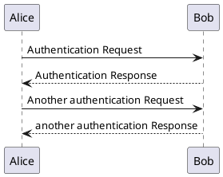
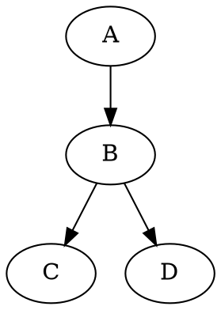

# Diagrams

## [Mermaid](https://shd101wyy.github.io/markdown-preview-enhanced/#/diagrams?id=mermaid)

`mermaid`


---

`mermaid {code_block=true}`


## [PlantUML](https://shd101wyy.github.io/markdown-preview-enhanced/#/diagrams?id=plantuml)

`puml`



---

`puml {align="center"}`

```puml {align="center"}
a->b
```

---

`plantuml`


## [WaveDrom](https://shd101wyy.github.io/markdown-preview-enhanced/#/diagrams?id=sequence-diagrams)

`wavedrom`

```wavedrom
{ signal : [
  { name: "clk",  wave: "p......" },
  { name: "bus",  wave: "x.34.5x",   data: "head body tail" },
  { name: "wire", wave: "0.1..0." },
]}
```

## [GraphViz](https://shd101wyy.github.io/markdown-preview-enhanced/#/diagrams?id=graphviz)

`viz`

```viz
digraph G {
  A -> B
  B -> C
  B -> D
}
```

---

`dot {engine=circo}`



## Vega

`vega` + json

```vega
{
  "$schema": "https://vega.github.io/schema/vega/v5.json",
  "width": 400,
  "height": 200,
  "padding": 5,

  "data": [
    {
      "name": "table",
      "values": [
        {"category": "A", "amount": 28},
        {"category": "B", "amount": 55},
        {"category": "C", "amount": 43},
        {"category": "D", "amount": 91},
        {"category": "E", "amount": 81},
        {"category": "F", "amount": 53},
        {"category": "G", "amount": 19},
        {"category": "H", "amount": 87}
      ]
    }
  ],

  "signals": [
    {
      "name": "tooltip",
      "value": {},
      "on": [
        {"events": "rect:mouseover", "update": "datum"},
        {"events": "rect:mouseout",  "update": "{}"}
      ]
    }
  ],

  "scales": [
    {
      "name": "xscale",
      "type": "band",
      "domain": {"data": "table", "field": "category"},
      "range": "width",
      "padding": 0.05,
      "round": true
    },
    {
      "name": "yscale",
      "domain": {"data": "table", "field": "amount"},
      "nice": true,
      "range": "height"
    }
  ],

  "axes": [
    { "orient": "bottom", "scale": "xscale" },
    { "orient": "left", "scale": "yscale" }
  ],

  "marks": [
    {
      "type": "rect",
      "from": {"data":"table"},
      "encode": {
        "enter": {
          "x": {"scale": "xscale", "field": "category"},
          "width": {"scale": "xscale", "band": 1},
          "y": {"scale": "yscale", "field": "amount"},
          "y2": {"scale": "yscale", "value": 0}
        },
        "update": {
          "fill": {"value": "steelblue"}
        },
        "hover": {
          "fill": {"value": "red"}
        }
      }
    },
    {
      "type": "text",
      "encode": {
        "enter": {
          "align": {"value": "center"},
          "baseline": {"value": "bottom"},
          "fill": {"value": "#333"}
        },
        "update": {
          "x": {"scale": "xscale", "signal": "tooltip.category", "band": 0.5},
          "y": {"scale": "yscale", "signal": "tooltip.amount", "offset": -2},
          "text": {"signal": "tooltip.amount"},
          "fillOpacity": [
            {"test": "datum === tooltip", "value": 0},
            {"value": 1}
          ]
        }
      }
    }
  ]
}
```

## Vega lite

`vega-lite` + json

```vega-lite
{
  "$schema": "https://vega.github.io/schema/vega-lite/v3.json",
  "description": "A simple bar chart with embedded data.",
  "data": {
    "values": [
      {"a": "A","b": 28}, {"a": "B","b": 55}, {"a": "C","b": 43},
      {"a": "D","b": 91}, {"a": "E","b": 81}, {"a": "F","b": 53},
      {"a": "G","b": 19}, {"a": "H","b": 87}, {"a": "I","b": 52}
    ]
  },
  "mark": "bar",
  "encoding": {
    "x": {"field": "a", "type": "ordinal"},
    "y": {"field": "b", "type": "quantitative"}
  }
}
```

---

`vega-lite` + yaml

```vega-lite
"$schema": https://vega.github.io/schema/vega-lite/v3.json
description: A simple bar chart with embedded data.
data:
  values: [
    {"a": "A","b": 28}, {"a": "B","b": 55}, {"a": "C","b": 43},
    {"a": "D","b": 91}, {"a": "E","b": 81}, {"a": "F","b": 53},
    {"a": "G","b": 19}, {"a": "H","b": 87}, {"a": "I","b": 52}
  ]
mark: bar
encoding:
  x:
    field: a
    type: ordinal
  y:
    field: b
    type: quantitative
```

---

`vega-lite {hide=false}` + json

```vega-lite {hide=false}
"$schema": https://vega.github.io/schema/vega-lite/v3.json
description: A simple bar chart with embedded data.
data:
  values: [
    {"a": "A","b": 28}, {"a": "B","b": 55}, {"a": "C","b": 43},
    {"a": "D","b": 91}, {"a": "E","b": 81}, {"a": "F","b": 53},
    {"a": "G","b": 19}, {"a": "H","b": 87}, {"a": "I","b": 52}
  ]
mark: bar
encoding:
  x:
    field: a
    type: ordinal
  y:
    field: b
    type: quantitative
```

---

`vega-lite {cmd=false}`

```vega-lite {cmd=false}
"$schema": https://vega.github.io/schema/vega-lite/v3.json
description: A simple bar chart with embedded data.
data:
  values: [
    {"a": "A","b": 28}, {"a": "B","b": 55}, {"a": "C","b": 43},
    {"a": "D","b": 91}, {"a": "E","b": 81}, {"a": "F","b": 53},
    {"a": "G","b": 19}, {"a": "H","b": 87}, {"a": "I","b": 52}
  ]
mark: bar
encoding:
  x:
    field: a
    type: ordinal
  y:
    field: b
    type: quantitative
```

---

`vega-lite` + json (geo)

```vega-lite
{
  "$schema": "https://vega.github.io/schema/vega-lite/v2.1.json",
  "width": 500,
  "height": 300,
  "data": {
    "url": "data/us-10m.json",
    "format": {
      "type": "topojson",
      "feature": "counties"
    }
  },
  "transform": [{
    "lookup": "id",
    "from": {
      "data": {
        "url": "data/unemployment.tsv"
      },
      "key": "id",
      "fields": ["rate"]
    }
  }],
  "projection": {
    "type": "albersUsa"
  },
  "mark": "geoshape",
  "encoding": {
    "color": {
      "field": "rate",
      "type": "quantitative"
    }
  }
}
```

---

`vega-embed`

```vega-lite
{
  "$schema": "https://vega.github.io/schema/vega-lite/v4.json",
  "description": "A simple bar chart with embedded data.",
  "width": 360,
  "data": {
    "values": [
      {"a": "A","b": 28}, {"a": "B","b": 55}, {"a": "C","b": 43},
      {"a": "D","b": 91}, {"a": "E","b": 81}, {"a": "F","b": 53},
      {"a": "G","b": 19}, {"a": "H","b": 87}, {"a": "I","b": 52}
    ]
  },
  "mark": "bar",
  "encoding": {
    "x": {"field": "a", "type": "ordinal"},
    "y": {"field": "b", "type": "quantitative"},
    "tooltip": {"field": "b", "type": "quantitative"}
  }
}
```

## Kroki

`ditaa {kroki=true}`

```ditaa {kroki=true}
+--------+   +-------+    +-------+
|        | --+ ditaa +--> |       |
|  Text  |   +-------+    |diagram|
|Document|   |!magic!|    |       |
|     {d}|   |       |    |       |
+---+----+   +-------+    +-------+
    :                         ^
    |       Lots of work      |
    +-------------------------+
```
